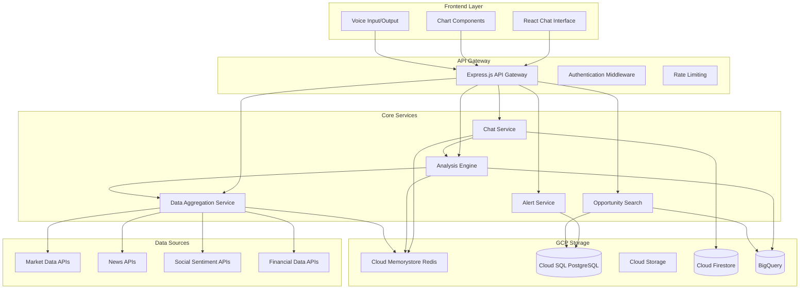

# Design Document

## Overview

Settlers of Stock is a conversational stock research application built as a modern web application with a React frontend and Node.js backend. The system integrates multiple financial data sources, implements AI-powered analysis engines, and provides real-time market insights through a chat-based interface. The architecture emphasizes modularity, scalability, and real-time data processing to deliver comprehensive stock analysis combining fundamental, technical, and sentiment analysis.

## Architecture

### High-Level Architecture



### Technology Stack

**Frontend:**
- React 18 with TypeScript for type safety
- Material-UI or Chakra UI for component library
- React Query for data fetching and caching
- Chart.js or Recharts for financial charts
- Web Speech API for voice input/output
- WebSocket client for real-time updates

**Backend:**
- Python 3.11+ with FastAPI framework
- Pydantic for data validation and serialization
- WebSocket support via FastAPI WebSockets
- Celery with Redis for background job processing
- JWT for authentication with python-jose
- CORS middleware for cross-origin requests

**Data & Storage (GCP):**
- Cloud SQL (PostgreSQL) for persistent data storage
- Cloud Memorystore (Redis) for caching and session management
- Cloud Storage for file storage (reports, exports, charts)
- Cloud Firestore for real-time chat message storage
- BigQuery for historical data analysis and backtesting

**Python Libraries:**
- pandas for data manipulation and analysis
- numpy for numerical computations
- yfinance for Yahoo Finance data
- requests for API calls
- scikit-learn for machine learning models
- textblob or VADER for sentiment analysis
- python-ta-lib for technical analysis indicators

**GCP Libraries:**
- google-cloud-sql-connector for Cloud SQL connections
- google-cloud-storage for file operations
- google-cloud-firestore for real-time chat storage
- google-cloud-bigquery for analytics and backtesting
- google-cloud-memorystore for Redis operations
- google-cloud-aiplatform for Vertex AI integration
- vertexai for Gemini model access

**External APIs (Cost-Effective):**
- **yfinance (Free)**: Primary source for market data and basic fundamentals
- **Alpha Vantage (Free tier)**: Backup market data, 500 calls/day
- **NewsAPI (Free tier)**: Financial news, 1,000 requests/day
- **Reddit API (Free)**: Social sentiment from financial subreddits
- **SEC EDGAR API (Free)**: Official fundamental data from SEC filings
- **Vertex AI (GCP)**: Natural language processing with Gemini models - cost-effective within GCP ecosystem

## Components and Interfaces

### Frontend Components

#### ChatInterface Component
```typescript
interface ChatMessage {
  id: string;
  type: 'user' | 'assistant' | 'system';
  content: string;
  timestamp: Date;
  metadata?: {
    stockSymbol?: string;
    analysisType?: string;
    charts?: ChartData[];
  };
}

interface ChatInterfaceProps {
  messages: ChatMessage[];
  onSendMessage: (message: string) => void;
  isLoading: boolean;
  voiceEnabled: boolean;
}
```

#### StockChart Component
```typescript
interface ChartData {
  symbol: string;
  timeframe: '1D' | '1W' | '1M' | '3M' | '1Y';
  data: PricePoint[];
  indicators: TechnicalIndicator[];
  annotations: ChartAnnotation[];
}

interface TechnicalIndicator {
  type: 'SMA' | 'EMA' | 'RSI' | 'MACD' | 'BB';
  period: number;
  data: number[];
  visible: boolean;
}
```

#### WatchlistManager Component
```typescript
interface WatchlistItem {
  symbol: string;
  name: string;
  currentPrice: number;
  dailyChange: number;
  dailyChangePercent: number;
  alerts: Alert[];
}

interface Watchlist {
  id: string;
  name: string;
  items: WatchlistItem[];
  createdAt: Date;
  updatedAt: Date;
}
```

### Backend Services

#### Chat Service (Python)
```python
from pydantic import BaseModel
from typing import List, Optional
from datetime import datetime

class ChatContext(BaseModel):
    previous_messages: List[ChatMessage]
    current_stocks: List[str]
    analysis_history: List[AnalysisResult]
    user_preferences: UserPreferences

class ChatService:
    async def process_message(self, user_id: str, message: str, context: ChatContext) -> ChatResponse:
        """Process user message and generate intelligent response"""
        pass
    
    def maintain_context(self, user_id: str, context: ChatContext) -> None:
        """Maintain conversation context in Cloud Memorystore Redis"""
        pass
    
    async def store_chat_message(self, user_id: str, message: ChatMessage) -> None:
        """Store chat messages in Cloud Firestore for real-time sync"""
        pass
    
    async def generate_response(self, analysis: AnalysisResult, user_query: str) -> str:
        """Generate natural language response using Vertex AI Gemini"""
        pass
    
    async def call_vertex_ai(self, prompt: str, context: ChatContext) -> str:
        """Call Vertex AI Gemini model for natural language generation"""
        pass

#### Vertex AI Integration Service (Python)
```python
import vertexai
from vertexai.generative_models import GenerativeModel
from google.cloud import aiplatform

class VertexAIService:
    def __init__(self, project_id: str, location: str = "us-central1"):
        vertexai.init(project=project_id, location=location)
        self.model = GenerativeModel("gemini-1.5-flash")  # Cost-effective model
        # Alternative: gemini-1.5-pro for higher quality when needed
    
    async def generate_stock_analysis_response(
        self, 
        analysis_data: AnalysisResult, 
        user_query: str,
        conversation_history: List[str] = None
    ) -> str:
        """Generate conversational response about stock analysis"""
        
        prompt = f"""
        You are a knowledgeable stock analyst assistant. Based on the following analysis data, 
        provide a conversational response to the user's query.
        
        Stock Analysis:
        - Symbol: {analysis_data.symbol}
        - Recommendation: {analysis_data.recommendation}
        - Confidence: {analysis_data.confidence}%
        - Key Points: {', '.join(analysis_data.reasoning)}
        - Risks: {', '.join(analysis_data.risks)}
        
        User Query: {user_query}
        
        Provide a helpful, conversational response that explains the analysis in plain English.
        Include specific numbers and reasoning, but keep it accessible.
        """
        
        response = await self.model.generate_content_async(prompt)
        return response.text
    
    async def generate_market_summary(self, market_data: List[MarketData]) -> str:
        """Generate market overview summary"""
        pass
    
    async def explain_technical_indicator(self, indicator: str, value: float, symbol: str) -> str:
        """Explain what a technical indicator means in context"""
        pass
```

#### Analysis Engine (Python)
```python
import pandas as pd
import numpy as np
from typing import Dict, Any

class AnalysisEngine:
    def __init__(self):
        self.fundamental_analyzer = FundamentalAnalyzer()
        self.technical_analyzer = TechnicalAnalyzer()
        self.sentiment_analyzer = SentimentAnalyzer()
    
    async def perform_fundamental_analysis(self, symbol: str) -> FundamentalAnalysis:
        """Analyze financial ratios, earnings, and company health"""
        pass
    
    async def perform_technical_analysis(self, symbol: str, timeframe: str) -> TechnicalAnalysis:
        """Calculate technical indicators using TA-Lib"""
        pass
    
    async def perform_sentiment_analysis(self, symbol: str) -> SentimentAnalysis:
        """Analyze news and social media sentiment"""
        pass
    
    async def generate_recommendation(self, analyses: CombinedAnalysis) -> Recommendation:
        """Combine all analyses to generate buy/sell/hold recommendation"""
        pass
```

#### Data Aggregation Service (Python)
```python
import yfinance as yf
import requests
from typing import Optional
import redis

class DataAggregationService:
    def __init__(self):
        self.redis_client = redis.Redis()  # Cloud Memorystore
        self.bigquery_client = bigquery.Client()
        self.storage_client = storage.Client()
        self.yf_cache = {}
    
    async def get_market_data(self, symbol: str) -> MarketData:
        """Fetch real-time market data using yfinance"""
        ticker = yf.Ticker(symbol)
        info = ticker.info
        market_data = MarketData.from_yfinance(info)
        
        # Store in BigQuery for historical analysis
        await self.store_historical_data(market_data)
        return market_data
    
    async def get_fundamental_data(self, symbol: str) -> FundamentalData:
        """Fetch fundamental data from multiple sources"""
        pass
    
    async def get_news_data(self, symbol: str, days: int) -> List[NewsItem]:
        """Aggregate news from multiple sources"""
        pass
    
    async def cache_data(self, key: str, data: Any, ttl: int) -> None:
        """Cache data in Cloud Memorystore Redis with TTL"""
        pass
    
    async def store_historical_data(self, data: MarketData) -> None:
        """Store market data in BigQuery for backtesting"""
        pass
```

## Data Models

### Core Stock Data Models (Python)

```python
from pydantic import BaseModel
from typing import List, Optional
from datetime import datetime
from decimal import Decimal

class Stock(BaseModel):
    symbol: str
    name: str
    exchange: str
    sector: str
    industry: str
    market_cap: int
    last_updated: datetime

class MarketData(BaseModel):
    symbol: str
    price: Decimal
    change: Decimal
    change_percent: Decimal
    volume: int
    high_52_week: Decimal
    low_52_week: Decimal
    avg_volume: int
    timestamp: datetime
    
    @classmethod
    def from_yfinance(cls, yf_data: dict) -> 'MarketData':
        """Create MarketData from yfinance ticker info"""
        return cls(
            symbol=yf_data.get('symbol'),
            price=yf_data.get('currentPrice', 0),
            change=yf_data.get('regularMarketChange', 0),
            change_percent=yf_data.get('regularMarketChangePercent', 0),
            volume=yf_data.get('volume', 0),
            high_52_week=yf_data.get('fiftyTwoWeekHigh', 0),
            low_52_week=yf_data.get('fiftyTwoWeekLow', 0),
            avg_volume=yf_data.get('averageVolume', 0),
            timestamp=datetime.now()
        )

class FundamentalData(BaseModel):
    symbol: str
    pe_ratio: Optional[Decimal]
    pb_ratio: Optional[Decimal]
    roe: Optional[Decimal]
    debt_to_equity: Optional[Decimal]
    revenue_growth: Optional[Decimal]
    profit_margin: Optional[Decimal]
    eps: Optional[Decimal]
    dividend: Optional[Decimal]
    dividend_yield: Optional[Decimal]
    quarter: str
    year: int

class TechnicalData(BaseModel):
    symbol: str
    timeframe: str
    sma_20: Optional[Decimal]
    sma_50: Optional[Decimal]
    ema_12: Optional[Decimal]
    ema_26: Optional[Decimal]
    rsi: Optional[Decimal]
    macd: Optional[Decimal]
    macd_signal: Optional[Decimal]
    bollinger_upper: Optional[Decimal]
    bollinger_lower: Optional[Decimal]
    support_levels: List[Decimal]
    resistance_levels: List[Decimal]
    timestamp: datetime
```

### Analysis Result Models (Python)

```python
from enum import Enum
from typing import List, Dict

class AnalysisType(str, Enum):
    FUNDAMENTAL = "fundamental"
    TECHNICAL = "technical"
    SENTIMENT = "sentiment"
    COMBINED = "combined"

class Recommendation(str, Enum):
    BUY = "BUY"
    SELL = "SELL"
    HOLD = "HOLD"

class TrendDirection(str, Enum):
    IMPROVING = "improving"
    DECLINING = "declining"
    STABLE = "stable"

class AnalysisResult(BaseModel):
    symbol: str
    analysis_type: AnalysisType
    score: int  # 0-100
    recommendation: Recommendation
    confidence: int  # 0-100
    reasoning: List[str]
    risks: List[str]
    targets: Dict[str, Decimal]  # short_term, medium_term, long_term
    timestamp: datetime

class SentimentData(BaseModel):
    symbol: str
    social_sentiment: Decimal  # -1 to 1
    analyst_sentiment: Decimal  # -1 to 1
    news_sentiment: Decimal  # -1 to 1
    overall_sentiment: Decimal  # -1 to 1
    trend_direction: TrendDirection
    sources: List[str]
    timestamp: datetime

class NewsItem(BaseModel):
    id: str
    title: str
    summary: str
    url: str
    source: str
    published_at: datetime
    sentiment: Decimal
    relevance_score: Decimal
    symbols: List[str]
```

### User and Preference Models

```typescript
interface User {
  id: string;
  email: string;
  preferences: UserPreferences;
  watchlists: Watchlist[];
  alerts: Alert[];
  createdAt: Date;
  lastActive: Date;
}

interface UserPreferences {
  riskTolerance: 'conservative' | 'moderate' | 'aggressive';
  investmentHorizon: 'short' | 'medium' | 'long';
  preferredAnalysis: ('fundamental' | 'technical' | 'sentiment')[];
  notificationSettings: NotificationSettings;
  displaySettings: DisplaySettings;
}

interface Alert {
  id: string;
  userId: string;
  symbol: string;
  type: 'price' | 'technical' | 'fundamental' | 'news';
  condition: AlertCondition;
  isActive: boolean;
  createdAt: Date;
  triggeredAt?: Date;
}
```

## Error Handling

### Error Classification and Response Strategy (Python)

```python
from enum import Enum
from typing import List, Optional, Any

class ErrorType(str, Enum):
    DATA_UNAVAILABLE = "DATA_UNAVAILABLE"
    API_RATE_LIMIT = "API_RATE_LIMIT"
    INVALID_SYMBOL = "INVALID_SYMBOL"
    ANALYSIS_FAILED = "ANALYSIS_FAILED"
    NETWORK_ERROR = "NETWORK_ERROR"
    AUTHENTICATION_ERROR = "AUTHENTICATION_ERROR"

class ErrorResponse(BaseModel):
    type: ErrorType
    message: str
    suggestions: List[str]
    fallback_data: Optional[Any] = None
    retry_after: Optional[int] = None

class StockAnalysisException(Exception):
    def __init__(self, error_type: ErrorType, message: str, suggestions: List[str] = None):
        self.error_type = error_type
        self.message = message
        self.suggestions = suggestions or []
        super().__init__(self.message)
```

### Graceful Degradation Strategy

1. **Data Source Failures**: Implement fallback data sources and cached data serving
2. **API Rate Limits**: Queue requests and implement exponential backoff
3. **Analysis Failures**: Provide partial analysis with clear limitations
4. **Network Issues**: Offline mode with cached data and sync when reconnected
5. **Invalid Inputs**: Intelligent suggestion system for stock symbols and queries

### Error Recovery Mechanisms (Python)

```python
import asyncio
from typing import Optional
import logging

class DataService:
    def __init__(self):
        self.primary_data_source = PrimaryDataSource()
        self.secondary_data_source = SecondaryDataSource()
        self.cache = RedisCache()
        self.logger = logging.getLogger(__name__)
    
    async def get_stock_data(self, symbol: str) -> MarketData:
        """Get stock data with fallback mechanisms"""
        try:
            return await self.primary_data_source.get_market_data(symbol)
        except Exception as error:
            self.logger.warning(f"Primary data source failed for {symbol}: {error}")
            
            if isinstance(error, RateLimitError):
                try:
                    return await self.secondary_data_source.get_market_data(symbol)
                except Exception as secondary_error:
                    self.logger.error(f"Secondary data source also failed: {secondary_error}")
            
            # Try cached data as last resort
            cached_data = await self.cache.get(f"market_{symbol}")
            if cached_data:
                cached_data.is_stale = True
                return cached_data
            
            raise StockAnalysisException(
                ErrorType.DATA_UNAVAILABLE,
                f"Unable to fetch data for {symbol}",
                ["Check symbol spelling", "Try again later"]
            )
    
    async def retry_with_backoff(self, func, max_retries: int = 3):
        """Implement exponential backoff for API calls"""
        for attempt in range(max_retries):
            try:
                return await func()
            except Exception as e:
                if attempt == max_retries - 1:
                    raise e
                wait_time = 2 ** attempt
                await asyncio.sleep(wait_time)
```

## Testing Strategy

### Unit Testing
- **Coverage Target**: 90%+ for core business logic
- **Framework**: Jest with TypeScript support
- **Focus Areas**: Analysis algorithms, data transformation, utility functions
- **Mock Strategy**: Mock external APIs and database calls

### Integration Testing
- **API Testing**: Test all REST endpoints and WebSocket connections
- **Database Testing**: Test data persistence and retrieval with test database
- **External API Testing**: Test integration with financial data providers
- **Cache Testing**: Verify Redis caching behavior and invalidation

### End-to-End Testing
- **Framework**: Playwright or Cypress
- **Scenarios**: Complete user workflows from query to analysis
- **Performance Testing**: Response times under various load conditions
- **Cross-browser Testing**: Ensure compatibility across major browsers

### Performance Testing
- **Load Testing**: Simulate concurrent users and API calls
- **Stress Testing**: Test system behavior under extreme conditions
- **Memory Testing**: Monitor for memory leaks in long-running processes
- **Database Performance**: Query optimization and indexing validation

### Security Testing
- **Authentication Testing**: JWT token validation and expiration
- **Input Validation**: SQL injection and XSS prevention
- **Rate Limiting**: API abuse prevention
- **Data Encryption**: Sensitive data protection in transit and at rest

### Test Data Management (Python)
```python
import pytest
from faker import Faker
from decimal import Decimal
import random

class TestDataFactory:
    def __init__(self):
        self.fake = Faker()
    
    def create_mock_market_data(self, symbol: str = "AAPL") -> MarketData:
        """Create mock market data for testing"""
        base_price = Decimal(str(random.uniform(50, 500)))
        return MarketData(
            symbol=symbol,
            price=base_price,
            change=Decimal(str(random.uniform(-10, 10))),
            change_percent=Decimal(str(random.uniform(-5, 5))),
            volume=random.randint(1000000, 100000000),
            high_52_week=base_price * Decimal("1.2"),
            low_52_week=base_price * Decimal("0.8"),
            avg_volume=random.randint(5000000, 50000000),
            timestamp=datetime.now()
        )
    
    def create_mock_fundamental_data(self, symbol: str = "AAPL") -> FundamentalData:
        """Create mock fundamental data for testing"""
        return FundamentalData(
            symbol=symbol,
            pe_ratio=Decimal(str(random.uniform(10, 30))),
            pb_ratio=Decimal(str(random.uniform(1, 5))),
            roe=Decimal(str(random.uniform(0.1, 0.3))),
            debt_to_equity=Decimal(str(random.uniform(0.1, 2.0))),
            revenue_growth=Decimal(str(random.uniform(-0.1, 0.3))),
            profit_margin=Decimal(str(random.uniform(0.05, 0.25))),
            eps=Decimal(str(random.uniform(1, 10))),
            dividend=Decimal(str(random.uniform(0, 5))),
            dividend_yield=Decimal(str(random.uniform(0, 0.05))),
            quarter="Q4",
            year=2024
        )

@pytest.fixture
def test_data_factory():
    return TestDataFactory()
```

### Continuous Integration
- **Pre-commit Hooks**: Linting, type checking, and unit tests
- **CI Pipeline**: Automated testing on pull requests
- **Deployment Testing**: Staging environment validation
- **Monitoring**: Real-time error tracking and performance monitoring